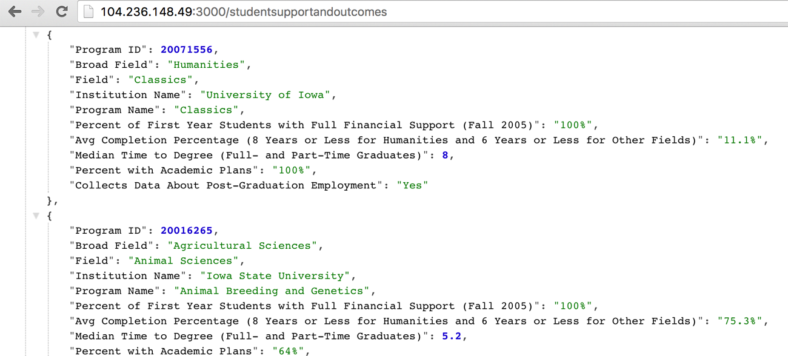

# lighthouse-api



|||
|---|---|
| Landing page: | [lighthouse-api.org](http://lighthouse-api.org) |
| Main source code: | [app.js](app.js) |

<code>lighthouse-api</code> is a queryable REST API, implemented using Node.js and MongoDB.  It provides a number of endpoints which return all the data from the [National Research Council's 2006 study](http://www.nap.edu/rdp/) (revised in 2011) of over 5000 PhD programs in the United States. The data is returned in JSON format.

You can either query the data directly, build a GUI (e.g. a iOS app or a search engine in the form of a website) that consumes these endpoints, or you can even mirror this service and modify it to fit your needs as you see fit. 

This is the same dataset that is used by [philphd.org](http://philphd.org).

Technical note: In addition to Node.js, I used Express.js; but not express-generator.


### Sample usage

##### In a web browser:

[http://104.236.148.49:3000/timetodegree](http://104.236.148.49:3000/timetodegree). (If you use chrome with a json formatter extension added, the returned JSON will look much more readable.)

##### Using curl:
```
$ curl http://104.236.148.49:3000/timetodegree
```

### Available endpoints (case insensitive, so all lowercase is fine:)

```
GET /dataNotUsedInRankings
GET /diversity
GET /emergingFields
GET /generalInformation
GET /otherOverallRankingMeasures
GET /rankings
GET /researchActivity
GET /studentActivities
GET /studentSupportAndOutcomes
GET /timeToDegree
```
