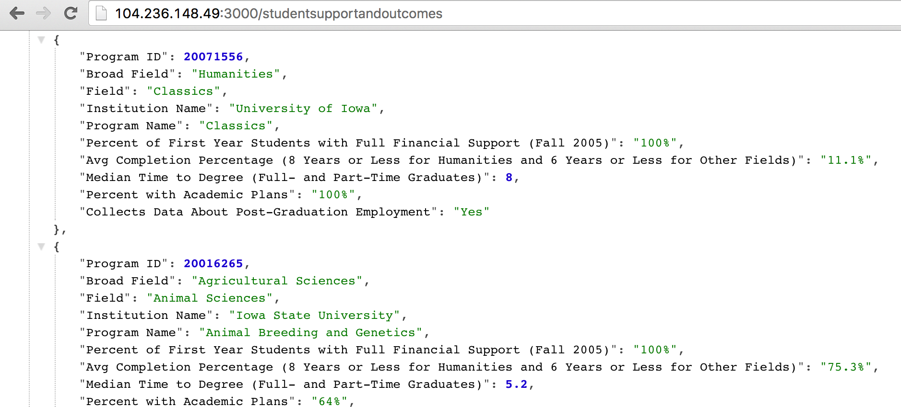

## To see this service live

See http://lighthouse-api.org




## To install as your own node.js service

DISCLAIMER: Quick-and-dirty instructions, so might be missing a step or two, or three.

You can install this on your laptop or up in the cloud.  Either way, you will need the following:
- node and npm.
- mongodb.
- a clone of this repo.

### 1. Install node and npm.  On Ubuntu, this might look as follows:

```
$ sudo apt-get update
$ sudo apt-get install build-essential libssl-dev
# if necessary: rm -rf /root/.nvm
$ curl -o- https://raw.githubusercontent.com/creationix/nvm/v0.29.0/install.sh | bash
$ source ~/.profile
$ nvm --version

$ nvm ls-remote
$ nvm install 0.12.7
$ nvm use 0.12.7
$ npm -v
```

### 2. Install and launch mongodb

### 3. Import the production dump into mongodb

In case you are curious, here's what I had to do, though you don't have to and shouldn't have to do this at all:
I had to first export data from NRC's excel file to csv.  I broke up NRC's giant master excel file into a collection of csv files (e.g. one for diversity metrics, one for student outcomes, and so on).  Then, I imported the csv files into mongo, one collection at a time (with one csv file corresponding to one collection), like so:
```
$ mongoimport --db nrc --collection studentSupportAndOutcomes --type=csv --headerline --file nrc.studentSupportAndOutcomes.csv
```
And so on for each csv file to be imported as a mongo collection.

### 4. Clone this repo and install Express in project directory

```
$ git clone 
$ cd lighthouse-api
$ npm install   # This will install the dependencies listed in package.json
```
